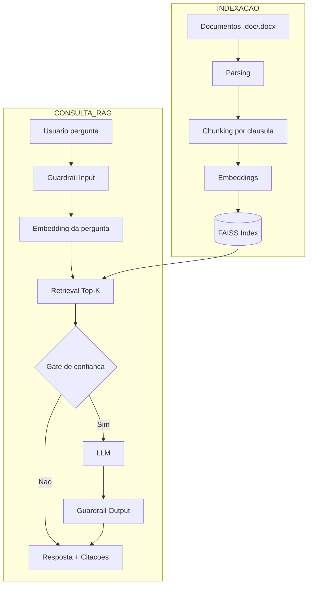

```mermaid
flowchart TB

%% ======================
%% INDEXACAO
%% ======================

subgraph INDEXACAO
direction TB
A1[Documentos .doc/.docx]
A2[Parsing]
A3[Chunking por clausula]
A4[Embeddings]
A5[(FAISS Index)]

A1 --> A2 --> A3 --> A4 --> A5
end

%% ======================
%% CONSULTA
%% ======================

subgraph CONSULTA_RAG
direction TB
B1[Usuario pergunta]
B2[Guardrail Input]
B3[Embedding da pergunta]
B4[Retrieval Top-K]
B5{Gate de confianca}
B6[LLM]
B7[Guardrail Output]
B8[Resposta + Citacoes]

B1 --> B2 --> B3 --> B4 --> B5
B5 -- Sim --> B6
B5 -- Nao --> B8
B6 --> B7 --> B8
end

A5 --> B4
```