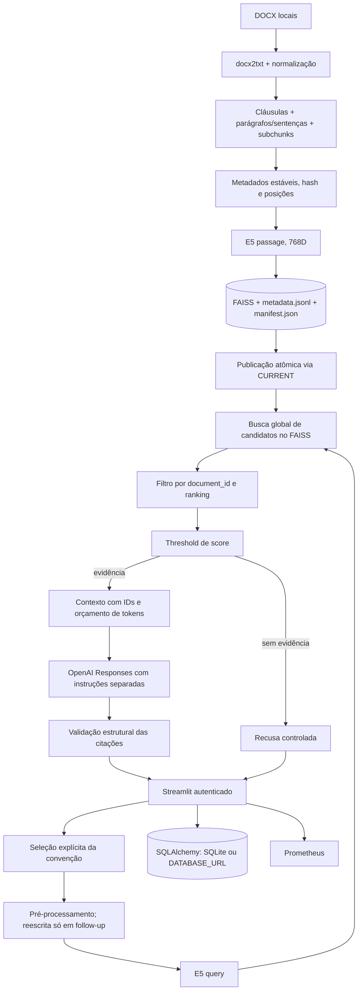

# Arquitetura do LexRAG

## Contratos e limites

- `answer_question(question, conversation_context="", document_id=None)` preserva a fachada principal. Uma pergunta normativa sem `document_id` recebe pedido de seleção.
- `FAISSStore.search(..., document_id=...)` exige o filtro. Faz busca exata em todos os vetores, filtra por documento e mantém a ordem de similaridade; apropriado para o corpus atual, mas O(N) por consulta.
- `retrieve_context` só aceita resultados acima de `MIN_RELEVANCE_SCORE`, sem fallback. Fonte tem `chunk_id`, `document_id`, título, cláusula, trecho e score. Score é semântico, não probabilidade de correção jurídica.
- Instruções ficam em `prompts/rag_prompt.txt` e são enviadas separadas da pergunta e dos trechos. Trechos são tratados como dados não confiáveis. Citações `[n]` precisam corresponder a IDs do contexto; uma saída sem IDs válidos é recusada.
- `metadata.jsonl` é JSON não executável. `CURRENT` aponta para diretório com índice, metadados e manifesto já validados. O índice FAISS anterior com `metadata.pkl` não é lido.
- O banco administrativo mantém esquema legado para preservar registros existentes. O caminho atual grava conteúdo textual vazio e métricas/IDs, inclusive erros. Não há migração destrutiva.
- A autenticação simples usa senha em ambiente ou `st.secrets`. A aplicação falha fechada sem configuração. A senha admin protege as páginas administrativas.
- O dataset gold testa recuperação de fontes. BM25 combinado é apenas benchmark; não há reranker nem inferência de precisão jurídica a partir dessas métricas.
