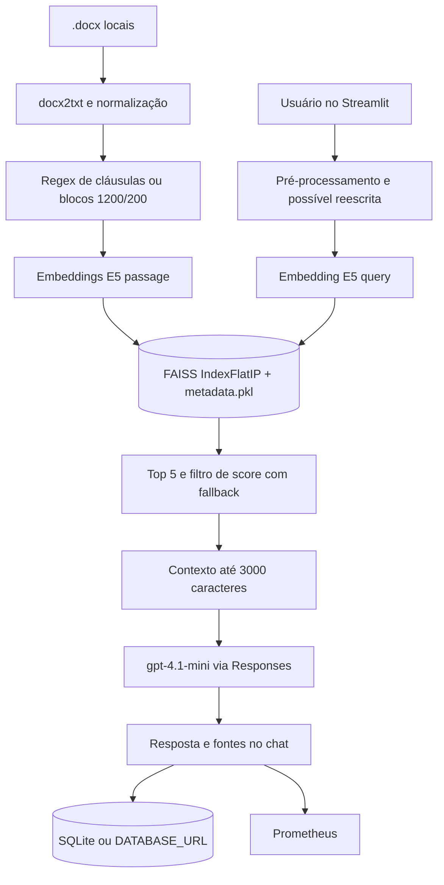
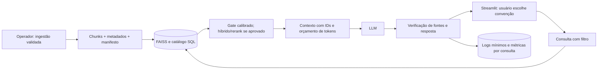

# Auditoria técnica, arquitetural e de produto — LexRAG

**Data:** 30/09/2026. **Método:** inspeção estática do repositório, leitura dos artefatos de avaliação e leitura não destrutiva do cabeçalho do índice FAISS. Não foram executadas consultas ao LLM, reindexação, testes que gravem dados nem inspeção visual em navegador. Conclusões sobre aparência e latência são inferências do código; precisam de validação em uso real. Referências `arquivo:linha` apontam para o estado auditado.

## A. Resumo executivo

O LexRAG é um protótipo funcional de consulta a convenções coletivas: há ingestão offline de `.docx`, embeddings locais E5, índice FAISS, respostas com `gpt-4.1-mini`, chat Streamlit, logs SQL, métricas Prometheus e um conjunto inicial de 25 perguntas de avaliação. O índice versionado contém **1.653 vetores de 768 dimensões** (leitura de `vectorstore/faiss.index`); o corpus local contém 34 arquivos `.doc` e 34 `.docx`, ignorados pelo Git. A execução completa não foi validada nesta auditoria.

Os riscos centrais para uso jurídico são: perguntas sem identificação da convenção podem combinar cláusulas de documentos distintos; o filtro de score reintroduz resultados abaixo do mínimo; as fontes exibidas não oferecem trecho, página ou acesso ao documento; e a avaliação automática confunde presença de palavras com correção e fundamentação. Há ainda fragilidades de acesso aos dados de debug, de concorrência na telemetria e de operação do índice. O próximo passo deve preservar Streamlit/FAISS e fortalecer seleção da base, evidência e testes antes de ampliar funcionalidades.

**Classificação:** 2 P0, 10 P1, 10 P2, 3 P3 (25 achados). P0 indica risco impeditivo para disponibilização pública ou resposta jurídica confiável, não comprovação de exploração ou dano.

## B. Arquitetura atual

| Camada | Implementação encontrada |
|---|---|
| Interface | `app.py` usa Streamlit, chat, perguntas sugeridas, `st.session_state` para `session_id`, histórico e estado de conversa. Não há API REST; o servidor Streamlit é a interface web. |
| Ingestão offline | `build_index.py` lê `convencoes coletivas` por `ingest/parser.py`. Somente `.docx` entra no parser. `convert_docs.py` converte `.doc` usando Microsoft Word/COM quando executado separadamente. |
| Extração e chunks | `docx2txt`, normalização de espaços e quebras; regex divide em cláusulas. Sem cláusula reconhecida, blocos de 1.200 caracteres com overlap de 200. Cláusulas com menos de 80 caracteres são descartadas. |
| Embeddings | `intfloat/multilingual-e5-base` via SentenceTransformers, `passage:` para chunks e `query:` para perguntas, batch 32 e normalização L2. Vetores `float32`, dimensão efetiva 768. |
| Vetores/metadados | `faiss.IndexFlatIP` e `metadata.pkl` em `vectorstore/`; o produto interno normalizado equivale a similaridade cosseno. Metadados: `filename`, `titulo`, `content`. Há validação de contagem e dimensão ao carregar. |
| Consulta | `rag_generator.py` faz pré-processamento por regras, classifica escopo por palavras e pode reescrever a pergunta com OpenAI se houver histórico. Busca semântica top-5 global, sem filtro por documento, lexical/BM25, híbrida, MMR ou reranker. |
| Contexto e geração | Aplica `MIN_SCORE=0.15`, mas usa os três primeiros resultados se nenhum passar; limita cada trecho a 900 caracteres e o contexto a 3.000 caracteres. Monta um único prompt textual e chama OpenAI Responses com `gpt-4.1-mini`, temperatura 0,1 e até 420 tokens. |
| Retorno e persistência | Faz limpeza e pós-processamento da resposta, anexa referências se faltarem, retorna texto e lista de fontes ao chat. A interface grava pergunta, resposta, fontes, contexto, prompt e métricas em SQLite por padrão ou banco indicado por `DATABASE_URL`. |
| Operação | Páginas Streamlit de Debug, Histórico e Monitoramento; senha administrativa única nas páginas. Métricas em HTTP porta 8000, quando o servidor inicia. |

**Detalhe importante:** a saída automática sobre o assunto/histórico pode responder sem retrieval (`rag_generator.py:825-842`). O histórico em tela é temporário da sessão; `query_logs` é um registro administrativo, sem função para retomar conversa. `query.py` é um caminho de busca CLI separado, atualmente quebrado por importação e dimensão antigas.

## C. Pontos fortes

- Separação inicial entre parser, embeddings, armazenamento vetorial, geração e observabilidade (`ingest/`, `embeddings/`, `vectorstore/`, `observability/`).
- Chunking por cláusula conserva título quando a regex reconhece a estrutura; há fallback para textos sem cláusulas (`ingest/parser.py:42-114`).
- Modelo multilíngue adequado como candidato para português, prefixos `query:`/`passage:` corretos no caminho web e vetores normalizados (`embeddings/embedder.py:8-64`). A qualidade precisa de medição no corpus.
- Validação de dimensão e alinhamento de metadados no FAISS (`vectorstore/faiss_store.py:36-53,104-113`).
- Prompt orienta resposta baseada em trechos e recusa quando evidência é insuficiente (`rag_generator.py:666-705`), embora isso não seja garantido tecnicamente.
- Telemetria, histórico administrativo, métricas e um dataset de avaliação oferecem base concreta para evolução.

## D. Problemas encontrados

| ID | Área | Problema | Evidência | Impacto | Prioridade |
|---|---|---|---|---|---|
| R01 | Segurança/deploy | Devcontainer inicia Streamlit com CORS e proteção XSRF desativados; não há autenticação na aplicação principal. | `.devcontainer/devcontainer.json:21-22`; `app.py:324-360` | Exposição pública ampliaria a superfície de abuso e acesso indevido. | P0 |
| R02 | Grounding | Consulta busca em todas as convenções sem selecionar documento/categoria/vigência; resposta pode reunir cláusulas incompatíveis. | `vectorstore/faiss_store.py:116-158`; `rag_generator.py:593-657`; exemplo de fontes de documentos diversos em `evaluation/evaluation_results_v2.json` | Conclusão jurídica potencialmente aplicada à convenção errada. | P0 |
| R03 | Retrieval | Quando nada supera 0,15, os três primeiros resultados entram no contexto; o gate de 0,10 exige `len(sources)==0` e quase nunca bloqueia contexto existente. | `rag_generator.py:599-607,868-878` | Respostas apoiadas em evidência fraca. | P1 |
| R04 | Citações | UI mostra arquivo, título e score, sem trecho, página, link ou preview; pós-processamento pode anexar fontes não usadas. | `app.py:144-184`; `rag_generator.py:714-765`; `ingest/parser.py:151-155` | Auditoria da resposta pelo usuário fica difícil e referências podem ser enganosas. | P1 |
| R05 | Avaliação | Classificador usa palavras no texto e em `str(source)`; não há gabarito por documento, passage IDs ou checagem de afirmações. | `evaluation/evaluation_set.json`; `evaluation/evaluate_rag_v2.py:101-123,141-172` | Percentuais de “correto” não demonstram fidelidade jurídica. | P1 |
| R06 | Chunking | Cláusulas não têm limite superior nem subdivisão; trechos são cortados a 900 caracteres no contexto. | `ingest/parser.py:66-79`; `rag_generator.py:627-645` | Parte decisiva de cláusula longa pode ficar fora da geração. | P1 |
| R07 | Metadados | Parser só mantém nome/título/texto; perde página, seção, categoria, partes, período de vigência e identidade estável. | `ingest/parser.py:151-155`; `build_index.py:24-29` | Sem filtros confiáveis, rastreabilidade e reindexação seletiva. | P1 |
| R08 | Segurança/dados | Logs persistem perguntas, respostas, contexto e prompt integrais; retenção e exclusão não aparecem. Páginas usam uma senha compartilhada sem papéis. | `observability/debug_store.py:39-50,114-128`; `pages/1_Debug.py:1-7`; `pages/2_Histórico.py:1-7` | Dados jurídicos e conteúdo de conversas podem ser expostos a quem tiver a senha. | P1 |
| R09 | Segurança | `metadata.pkl` versionado é desserializado com `pickle.load`; integridade do artefato precisa ser garantida. | `vectorstore/faiss_store.py:89-92`; `git ls-files` | Artefato alterado por fonte não confiável pode executar código no carregamento. | P1 |
| R10 | Concorrência | `telemetry` é objeto global mutável e `reset()` ocorre por consulta; dados de usuários simultâneos podem se misturar. | `observability/telemetry.py:5-36`; `rag_generator.py:819-821`; `app.py:267-315` | Métricas, logs e trace IDs inconsistentes; possível vazamento entre consultas. | P1 |
| R11 | Operação do índice | Reindexação grava índice e metadados em sequência, sem publicação atômica, versão/modelo/manifesto ou invalidação do cache de carga. | `vectorstore/faiss_store.py:56-72`; `build_index.py:94-96`; `rag_generator.py:43-52` | Atualização pode deixar arquivos desencontrados e processos com índice antigo. | P1 |
| R12 | Ingestão | `.doc` exige Word/COM por script separado e `win32com` não consta em `requirements.txt`; ambiente Linux do devcontainer não executa essa conversão. | `convert_docs.py:1-22`; `requirements.txt`; `.devcontainer/devcontainer.json:4` | Reproduzir ingestão original em Codespaces/Linux é difícil. | P1 |
| R13 | Engenharia | `query.py` importa `guadrails` inexistente e instancia FAISS com 384 apesar de o índice conter 768. `core/guardrails.py` contém imports/nomes inválidos. | `query.py:3,18`; `core/guardrails.py:1,5,7,46`; índice FAISS | Busca CLI anunciada no README falha; guardrails prometidos não atuam. | P2 |
| R14 | Ingestão | Sem hash de documento, deduplicação só por tupla exata com filename; documentos `.doc`/`.docx` convertidos ou versões semelhantes podem gerar duplicatas sem detecção. | `build_index.py:32-47`; pasta `convencoes coletivas` | Ruído no ranking e custo de reindexação. | P2 |
| R15 | Ingestão | Falha em arquivo individual é impressa e ignorada; não há relatório estruturado de cobertura ou decisão para documento inválido. | `ingest/parser.py:129-160` | Índice pode estar incompleto sem sinal operacional claro. | P2 |
| R16 | Retrieval | Somente busca densa top-5, sem filtros lexicais ou diversidade; nomes, percentuais e números exatos podem perder para similaridade geral. | `rag_generator.py:20,593-607`; `vectorstore/faiss_store.py:130-131` | Recall e precisão podem ser insuficientes em perguntas jurídicas específicas. | P2 |
| R17 | Geração | Contexto e pergunta ficam no mesmo texto de instrução da chamada LLM; não há delimitação robusta nem validação de citações/afirmações contra trechos. | `rag_generator.py:666-705,708-765,773-778` | Prompt injection em documentos e alucinações não são verificadas. | P2 |
| R18 | Latência/custo | Em conversas com histórico, a reescrita usa LLM mesmo para pergunta independente; processamento e geração são síncronos, sem streaming. | `rag_generator.py:540-580,851-885`; `app.py:279-284` | Resposta demora mais e faz chamadas pagas adicionais. | P2 |
| R19 | Observabilidade | Exceções do chat aparecem na UI, mas `save_query_log` só ocorre no caminho de sucesso; inicialização do servidor de métricas engole falhas. | `app.py:305-321,329-336` | Painel subconta erros e pode sugerir operação normal. | P2 |
| R20 | Produto | Sem upload, gestão/exclusão/reindexação, seleção de convenção, preview, feedback, copiar/exportar ou retomada de chat. | `app.py`; `build_index.py`; `pages/` | Fluxo depende de operador técnico e fontes não são verificáveis no produto. | P2 |
| R21 | DevOps | Não há testes automatizados, CI, Docker de implantação, `.env.example`, migrations ou health check; devcontainer não é imagem de produção. | arquivos versionados (`git ls-files`); `.devcontainer/devcontainer.json` | Regressões e implantação têm pouca garantia. | P2 |
| R22 | Engenharia | `observability/db.py` duplica esquema/conexão de `debug_store.py`, mas app usa o segundo; caminhos e configurações estão hardcoded. | `observability/db.py`; `observability/debug_store.py`; `build_index.py:11`; `rag_generator.py:18-25` | Manutenção e evolução de esquema ficam propensas a divergência. | P2 |
| R23 | Documentação | README diz MiniLM/384 e “observabilidade completa”, mas web usa E5/768 e erros não são persistidos; árvore menciona diretório diferente. | `README.md`; `embeddings/embedder.py:8`; `rag_generator.py:49`; `app.py:317-321` | Instalação, expectativas e apresentação ficam inconsistentes. | P3 |
| R24 | Produto/UI | Interface é essencialmente widgets Streamlit padrão, com status “RAG ativo” fixo e sem verificação real de índice/API. | `app.py:58-141` | Aparência e feedback se assemelham a demonstração, sobretudo em falha de serviço. | P3 |
| R25 | Apresentação | README não traz screenshots, licença, teste reproduzível, limites claros ou instrução da conversão `.doc`; `prompts/rag_prompt.txt` está vazio. | `README.md`; `prompts/rag_prompt.txt`; `convert_docs.py` | Avaliação externa do projeto e onboarding ficam incompletos. | P3 |

## E. Avaliação RAG

### Ingestão

O parser aceita **somente `.docx`**; `.doc` aparece como fonte local, mas depende de conversão manual com Word no Windows. `docx2txt` extrai texto e o normalizador ajusta espaços/quebras (`ingest/parser.py:9-34`). Não há OCR, PDF, upload, limpeza semântica, validação de tipo/tamanho, hash de documento nem processamento incremental. O lote é uma varredura sequencial; arquivo ilegível é pulado com `print`. A reindexação é integral; não existe exclusão individual ou relatório do que mudou. O corpus local ignorado pelo Git tem 34 pares `.doc`/`.docx`, enquanto o índice está versionado sem manifesto que vincule cada vetor à versão de origem.

### Chunking

Regex ancorada em `CLÁUSULA` aceita variações com/sem acento (`ingest/parser.py:55-79`). É uma boa hipótese para CCTs estruturadas, mas o texto anterior à primeira cláusula é descartado quando há match, e cláusulas curtas abaixo de 80 caracteres também somem. Cláusulas longas não são subdivididas; o fallback de 1.200/200 usa **caracteres**, pode quebrar frases e não guarda título de seção. Não há contagem por tokens nem verificação de cobertura/qualidade do parsing. O limite de 900 caracteres por fonte na consulta agrava perda de finais de cláusula.

### Embeddings

O código atual usa **`intfloat/multilingual-e5-base`**, não o MiniLM citado no README (`embeddings/embedder.py:8`; `README.md`). O índice presente é 768D. Prefixos de E5 e normalização estão implementados. Embedding local evita custo por token do provedor, mas usa CPU/memória e pode truncar texto longo conforme limite do modelo; essa extensão não foi medida no corpus. Idioma português é suportado pelo modelo multilíngue, mas adequação jurídica precisa de benchmark. Não há versão de modelo armazenada junto ao índice nem reindexação controlada ao mudar embeddings.

### Retrieval

`IndexFlatIP` faz busca exata por produto interno de vetores normalizados (similaridade cosseno), top-5 global, sem metadados filtráveis (`vectorstore/faiss_store.py:14,116-158`). Score mínimo nominal 0,15; se nenhum resultado passar, três voltam ao contexto. O gate posterior é inefetivo quando já há fonte. Não há busca lexical/BM25, híbrida, MMR ou threshold calibrado por conjunto de validação. Exemplos de resultados versionados mostram documentos diferentes no mesmo conjunto de fontes; como a pergunta não escolhe convenção, o risco principal é misturar normas.

### Reranking

Não existe reranker. Após construir perguntas e gabarito com documento correto, vale comparar top-5 atual com uma recuperação inicial maior e reranking dos candidatos para reduzir falsos positivos. Só incluir se o ganho de precisão/recall justificar latência e custo medidos; em 1.653 vetores, filtros por convenção e busca lexical podem trazer mais benefício primeiro.

### Contexto e geração

O contexto tem no máximo 3.000 caracteres e cada trecho no máximo 900; blocos são adicionados pela ordem de ranking até o próximo não caber (`rag_generator.py:627-657`). Isso reduz stuffing total, mas pode desperdiçar espaço quando o bloco seguinte é grande. O prompt está hardcoded em `rag_generator.py:666-705`; o arquivo `prompts/rag_prompt.txt` está vazio. O contexto é texto não confiável inserido no mesmo `input` que as regras, sem fronteira de papéis verificada. O LLM é `gpt-4.1-mini` via Responses, em chamada síncrona. A reescrita com histórico também usa esse modelo.

### Grounding e citações

O prompt pede uso exclusivo das fontes e linguagem de incerteza, mas não existe verificador factual. `append_sources_if_missing` pode adicionar até três referências recuperadas sem comprovar uso; o parser não registra página nem posição. O chat mostra título, arquivo e score, mas não o trecho nem link para abrir o documento. O sistema portanto fornece **referências indicativas**, não citação auditável por afirmação. A triagem de escopo por palavras pode tanto barrar perguntas pertinentes quanto aceitar perguntas vagas (`rag_generator.py:285-305`). `core/guardrails.py` não é chamado pelo fluxo web e está inválido.

### Avaliação

Há 25 perguntas temáticas e dois scripts de avaliação. O resultado v2 salvo em `evaluation/evaluation_results_v2.json`, datado de 13/03/2026, registra 0 `correct`, 18 `correct_but_contaminated`, 1 `wrong` e 6 `no_evidence`. A classe “correct” depende de palavras no texto/fonte, e “contaminated” é detectada por marcadores textuais; isso não equivale a revisão jurídica. Não há gabarito de resposta com convenção/chunk esperado, casos adversariais, respostas sem evidência verificadas, recall@k, precision@k, MRR, NDCG, faithfulness, answer/context relevance, RAGAS, DeepEval ou regressão em CI. O README interpreta os resultados como 72% corretos e 96% corretos/recusados; essas percentagens devem ser tratadas apenas como rótulos heurísticos do script.

## F. Avaliação de produto/UI

A página principal oferece título claro, exemplos, chat, spinner e fontes recolhidas por resposta. Há estados vazios básicos e botão para limpar conversa. A experiência ainda parece um **MVP técnico**: textos explicam a stack ao usuário, o status é sempre “ativo”, perguntas sugeridas não contextualizam qual convenção será consultada, e não há caminho para conferir a cláusula no documento. O chat não mostra estado do acervo, data da indexação ou escopo da resposta; erro interno aparece como texto bruto (`app.py:317-321`). O histórico visível se perde ao encerrar a sessão, embora exista log administrativo persistente. Layout é `wide` com colunas para sugestões; a responsividade, acessibilidade de teclado/leitor de tela e contraste precisam de teste visual, pois não há evidência de validação mobile. Não há tema claro/escuro próprio; fica a cargo do Streamlit. Páginas administrativas expostas na navegação exigem senha individualmente, mas o produto não apresenta papéis nem navegação separada para usuários finais.

**Funcionalidades com benefício imediato:** seleção/filtro de convenção, visualização de trecho e documento, gestão de reindexação pelo operador e retomada de sessão se uso recorrente for confirmado. **Opcionais após validação:** feedback útil para dataset, copiar/exportar conversa. Múltiplas coleções, painel complexo de permissões e novas configurações só fazem sentido quando houver usuários e acervos distintos. Rate limiting e limites de tamanho de entrada devem anteceder exposição pública; upload requer validação, armazenamento e processo operacional antes de entrar na UI.

## G. Dívida técnica

`rag_generator.py` reúne regras de conversa, retrieval, prompt e geração em quase mil linhas; `main()` duplica parte de `answer_question`. `query.py`/`core/guardrails.py` estão desatualizados ou inválidos. Há dois módulos de banco com esquemas próximos (`observability/db.py` e `debug_store.py`), caminhos relativos e constantes hardcoded. Logs usam `print` no parser e exceções genéricas; typing cobre apenas parte das funções. O cache de componentes impede recarga de índice no mesmo processo. A API pública de fato é `answer_question(question, conversation_context="")` dentro do app, não um serviço HTTP separado; preservar essa assinatura ajuda a evolução gradual.

## H. Segurança

- **Segredos:** `.streamlit/secrets.toml` existe localmente com chaves de configuração, está ignorado pelo Git e não aparece em `git ls-files`; valores não foram reproduzidos. Manter fora de logs, backups públicos e artefatos de deploy. Não foi observado segredo versionado na listagem Git.
- **Acesso web:** app principal não autentica nem limita consultas. Devcontainer desativa CORS/XSRF, o que requer revisão antes de expor a porta. Senha compartilhada protege três páginas administrativas, sem identidade, autorização fina, auditoria de acesso ou limitação de tentativas.
- **Dados:** `query_logs` guarda pergunta, resposta, fontes, contexto e prompt integralmente; não há política de retenção/remoção. Histórico administrativo pode conter dados sensíveis de usuários e de documentos. O erro mostrado com `st.error(f"Erro na consulta: {exc}")` pode revelar detalhes internos.
- **Artefatos:** `pickle.load` em `metadata.pkl` exige origem e integridade confiáveis. O arquivo está versionado; uma alteração maliciosa no artefato poderia ser perigosa ao carregar. FAISS e metadados precisam de publicação conjunta.
- **Entrada/prompt:** não há upload web, então path traversal por upload não é uma rota atual. O script de conversão lê nomes da pasta local. SQL usa parâmetros nas consultas (`observability/debug_store.py:87-128,169-188`), reduzindo risco de injeção nessa rota. O texto dos documentos pode conter instruções adversariais e é interpolado no prompt; `core/guardrails.py` não mitiga isso no app. Renderização passa por `st.markdown`, que não fornece evidência de HTML inseguro habilitado; XSS deve ser reavaliado se HTML ou preview rico forem adicionados. Vulnerabilidades de dependências não foram verificadas contra advisory atualizado nesta auditoria offline.

## I. Performance

O FAISS plano com 1.653 vetores é apropriado para o tamanho atual; trocar banco vetorial agora não parece prioritário. Gargalos prováveis: reindexação integral e sequencial, inicialização de modelo local, embedding CPU por consulta, chamada LLM de reescrita em todo turno com histórico e chamada LLM de geração síncrona. `@lru_cache` evita recarga do modelo/índice por processo, mas impede atualização visível do índice sem reiniciar/invalidar. Não há streaming, cache de embedding de pergunta ou respostas, nem métricas de tempo de ingestão, primeiro token ou custo/tokens da OpenAI. `MAX_CHARS` limita prompt, mas não há orçamento por tokens. A persistência abre/cria engine por chamada; avaliar pooling após medição. Prometheus mede tempo total/retrieval/geração e scores, mas não reescrita, custo nem cobertura de fontes. Sem medição real não é possível afirmar latência ou custo por consulta.

## J. Testes e observabilidade

Não há suíte `pytest`/CI nem teste automatizado de parser, filtros, integração do pipeline ou regressão. Os dois scripts de avaliação exigem chamada ao LLM e gravam resultados em JSON; são experimentos manuais, não um gate confiável. Observabilidade existente registra `trace_id`, sessão, contexto, prompt, fontes e tempos, e oferece dashboard; o registro de falhas é incompleto porque o `except` da UI não grava log. `telemetry` global deve ser isolada por requisição para métricas corretas em concorrência. Falta monitorar qualidade da indexação (documentos lidos/ignorados, chunks, distribuição de tamanhos), validade do índice, taxa de respostas sem evidência, custo e avaliações por versão de corpus/modelo.

## K. Melhorias recomendadas

### MUST HAVE

1. Exigir seleção inequívoca da convenção ou metadados/filtros de documento, categoria e vigência antes da resposta normativa; recusar ambiguidade.
2. Corrigir filtro de relevância e gate de ausência de evidência; calibrar limites com casos positivos e negativos do corpus.
3. Preservar identificadores/posição de origem e exibir trecho verificável; validar que cada `[Fonte X]` citada pertence ao contexto e sustenta a afirmação.
4. Criar gabarito pequeno, revisado por domínio, com documento/chunk esperados e casos sem resposta; medir retrieval e fidelidade antes de declarar qualidade.
5. Antes de publicar, reativar proteções web, controlar acesso ao chat/admin, reduzir dados retidos e tratar `metadata.pkl` como artefato confiável.
6. Tornar reindexação versionada e atômica, com manifesto de modelo/corpus e relato de falhas de ingestão.

### SHOULD HAVE

1. Subdividir cláusulas longas por parágrafo/limite de tokens preservando título, posição e relação com a cláusula original.
2. Consertar busca CLI e guardrails ou retirá-los da documentação operacional; unificar módulos de banco e configuração.
3. Isolar telemetria por consulta, gravar erros, medir reescrita, primeiro token, custo e cobertura; adicionar testes de regressão e CI.
4. Avaliar busca lexical/híbrida e reranking somente após o baseline filtrado e um benchmark de precisão/latência.
5. Melhorar estados de carga/erro, navegação das fontes, responsividade e acessibilidade; documentar corpus, instalação, arquitetura real e limitações.

### COULD HAVE

1. Gestão de documentos e upload operacional, com validação de formato/tamanho, deduplicação e reindexação controlada.
2. Feedback por resposta, copiar/exportar e retomada de sessão, se houver uso recorrente comprovado.
3. Múltiplas coleções, autenticação por papéis e dashboards adicionais quando o volume/organização exigir.

## L. Roadmap sugerido

### Fase 1 — Fundação

Corrigir acesso/segurança de deploy, preservar artefatos confiáveis, resolver CLI/guardrails e duplicação de banco, introduzir configuração documentada, testes básicos e publicação atômica do índice. Critério: instalação reproduzível e falha de ingestão/consulta visível sem expor detalhe sensível.

### Fase 2 — Qualidade do RAG

Extrair metadados de documento e localização, selecionar convenção, revisar chunking, corrigir gate e citações. Construir conjunto de casos revisados; comparar top-k atual com filtro, lexical/híbrido e reranking sob métricas de qualidade/latência. Critério: resposta sempre identificada com convenção e evidência verificável, inclusive recusa calibrada.

### Fase 3 — Produto

Exibir acervo/escopo, preview da cláusula e estados claros; melhorar mobile/acessibilidade. Implementar gestão de documentos e sessão persistente apenas para operadores/usuários que precisem. Critério: usuário consegue entender qual documento foi consultado e conferir a resposta sem acessar a página Debug.

### Fase 4 — Observabilidade e avaliação

Instrumentar ingestão, retrieval, geração, erros e custo por versão; executar regressões automáticas e revisão humana amostral. Aplicar retenção e acesso aos logs. Critério: dashboards distinguem qualidade de busca, fidelidade, erro e latência, sem interpretar score vetorial como correção jurídica.

## M. Arquitetura proposta

Manter Python, Streamlit, FAISS e SQLAlchemy/SQLite (ou `DATABASE_URL` quando houver necessidade operacional). Separar funções de ingestão, retrieval, composição e geração dentro do projeto existente, mantendo `answer_question` como fachada. Ingestão offline produz chunks com `document_id`, versão/hash, categoria, partes, vigência, cláusula, posição e trecho; valida cobertura, faz embeddings E5 e publica índice + metadados + manifesto em conjunto. Consulta recebe convenção explícita ou pede escolha, reescreve apenas follow-ups, busca candidatos filtrados no FAISS, aplica threshold calibrado e, se o benchmark justificar, combina BM25/reranker. Montagem usa trechos completos dentro de orçamento por tokens e IDs estáveis; LLM recebe instruções separadas do conteúdo não confiável. Verificador de saída checa IDs de fontes e sinaliza evidência insuficiente. UI mostra resposta, origem e preview; logs por requisição guardam metadados mínimos com retenção. Uma API REST seria opcional se houver outro cliente, não pré-requisito para profissionalizar este app.

## N. Arquivos que precisarão ser alterados

| Arquivo | Alteração sugerida | Motivo |
|---|---|---|
| `ingest/parser.py` | Guardar localização/metadados; medir cobertura e limitar tamanho de cláusula. | Evitar perda de contexto e habilitar filtros/citações. |
| `build_index.py` | Manifesto de corpus/modelo, validação e publicação atômica. | Reindexação confiável. |
| `convert_docs.py` | Explicitar dependência Windows ou definir conversão portátil após avaliar necessidade. | Reproduzir ingestão `.doc`. |
| `embeddings/embedder.py` | Registrar versão/dimensão do modelo no manifesto. | Compatibilidade e reindexação. |
| `vectorstore/faiss_store.py` | Metadados/IDs estáveis, filtro de documento e formato seguro de metadados. | Busca precisa e menor risco de artefato. |
| `rag_generator.py` | Separar fluxo, corrigir gate, filtrar corpus, orçamento por tokens, citações e reescrita condicional. | Grounding, custo e manutenção. |
| `app.py` | Seleção de convenção, fontes verificáveis, estados/erros, controle de acesso e telemetria por consulta. | UX e segurança. |
| `observability/telemetry.py`, `observability/decorators.py` | Estado por requisição e registro correto de falhas. | Evitar mistura em concorrência. |
| `observability/debug_store.py`, `observability/db.py` | Unificar persistência, retenção, migração e acesso. | Privacidade e esquema consistente. |
| `pages/1_Debug.py`, `pages/2_Histórico.py`, `pages/3_Monitoramento.py` | Centralizar autorização e limitar dados expostos. | Acesso administrativo confiável. |
| `query.py`, `core/guardrails.py` | Reparar importações/dimensão e integrar ou remover código sem uso. | CLI funcional e documentação honesta. |
| `evaluation/evaluation_set.json`, `evaluation/evaluate_rag.py`, `evaluation/evaluate_rag_v2.py` | Adicionar gabaritos por fonte e métricas de retrieval/fidelidade. | Medir qualidade real. |
| `.devcontainer/devcontainer.json` | Rever flags de segurança e fluxo de dependências. | Ambiente de desenvolvimento seguro. |
| `README.md`, `ARCHITECTURE.md`, `requirements.txt`, `prompts/rag_prompt.txt` | Corrigir stack, instruções, limites, dependências e origem do prompt. | Reprodutibilidade e apresentação. |

**Arquivos novos em etapa futura, se aprovados:** testes automatizados, `.env.example`, configuração de CI, manifesto do índice e documentação de privacidade/deploy. Esta auditoria não os criou nem alterou arquivos de produção.
