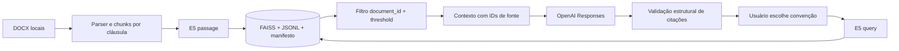

# LexRAG

LexRAG consulta **uma convenção coletiva por vez** e apresenta a resposta com trechos de origem verificáveis. É uma ferramenta de apoio à leitura, não substitui a conferência do instrumento nem parecer jurídico. O projeto usa Python, Streamlit, FAISS, `intfloat/multilingual-e5-base` (768 dimensões), OpenAI Responses (`gpt-4.1-mini` por padrão), SQLAlchemy/SQLite e Prometheus.

## Como funciona



O parser preserva cláusula, título, posições aproximadas e IDs estáveis. Página é `null` porque `docx2txt` não oferece paginação confiável. Categoria, sindicatos, território e vigência também ficam `null` quando não foram extraídos com segurança. A busca exige `document_id`; resultados abaixo de `MIN_RELEVANCE_SCORE` não entram no contexto. Sem evidência, não há chamada ao LLM. A resposta gerada deve citar `[1]`, `[2]` etc.; IDs desconhecidos ou ausentes levam a recusa controlada. Isso verifica o vínculo da citação com o contexto, mas **não prova fidelidade jurídica de cada afirmação**.

## Instalação

Use Python 3.11 e execute na raiz:

```bash
python -m venv venv
pip install -r requirements.txt
```

Ative o ambiente virtual conforme seu shell. Configure `OPENAI_API_KEY` para gerar respostas e `LEXRAG_ADMIN_PASSWORD` para proteger as páginas Debug, Histórico e Monitoramento, por variável de ambiente ou `st.secrets`. O chat abre sem senha; as páginas administrativas bloqueiam o acesso quando a senha não está configurada. `.env.example` documenta as variáveis; `.env` e `.streamlit/secrets.toml` são ignorados pelo Git. O arquivo `.env` não é carregado automaticamente: exporte as variáveis no ambiente ou use os secrets do Streamlit.

## Documentos e indexação

Coloque arquivos `.docx` em `convencoes coletivas/` e execute:

```bash
python build_index.py
```

Arquivos `.doc` exigem conversão prévia. `convert_docs.py` usa Microsoft Word via COM no Windows e requer `pywin32`, que não é necessário para a execução web e por isso não está nas dependências principais. Em Linux/Codespaces, converta para `.docx` por processo externo antes da indexação. O diretório de documentos não é versionado.

O novo índice fica em `vectorstore/versions/<versão>/` com `faiss.index`, `metadata.jsonl` e `manifest.json`. `vectorstore/CURRENT` aponta para a versão publicada. Esses artefatos contêm texto do corpus e **não são versionados**; cada instalação precisa receber os documentos autorizados e executar a indexação. A troca do ponteiro é atômica; versões anteriores podem ser mantidas para recuperação. O cache do app acompanha a versão do ponteiro. O índice legado `faiss.index`/`metadata.pkl` não é carregado pela versão atual; reindexe antes de iniciar. O manifesto registra modelo, dimensão, hash do corpus, contagens e data.

## Execução

```bash
streamlit run app.py
```

Ao abrir o chat, selecione uma convenção na barra lateral. Trocar a convenção inicia uma nova conversa para evitar referências cruzadas. O chat mostra o trecho citado, cláusula, nome, score vetorial e `chunk_id` em cada fonte. O bloco “Copiar resposta” usa o botão de cópia do componente de código do Streamlit. As páginas administrativas usam a credencial administrativa compartilhada; não há OAuth ou perfis por usuário. Não exponha a aplicação diretamente à internet sem controle de rede e revisão operacional. O devcontainer é apenas ambiente de desenvolvimento, com CORS/XSRF padrão do Streamlit.

Para inspecionar a busca local:

```bash
python query.py
python query.py --document-id <id> "Qual é a vigência?"
```

## Testes e avaliação

```bash
pip install -r requirements-dev.txt
pytest tests -q
ruff check . --select E4,E7,E9,F --exclude vectorstore/versions
python evaluation/evaluate_retrieval.py --check-dataset
python evaluation/evaluate_retrieval.py --benchmark
```

`--check-dataset` funciona sem modelo/API. `--benchmark` exige o índice novo e o modelo E5 disponível localmente, mas não usa a API OpenAI. O conjunto de 18 casos em `evaluation/gold_dataset.json` foi derivado de cláusulas presentes no corpus local; 16 casos têm `chunk_id` esperado e 2 são negativos exploratórios. As métricas são de **localização de fonte**, não de precisão jurídica. O benchmark compara busca global antiga (A), busca filtrada (B) e uma combinação BM25 experimental (C). A busca híbrida não é usada no produto sem ganho validado. Reranking não foi implementado.

Os scripts `evaluation/evaluate_rag.py` e `evaluate_rag_v2.py` e seus resultados são históricos, heurísticos e não devem ser interpretados como benchmark jurídico. O CI executa lint, import/compilação, testes e checagem estrutural offline, sem chave OpenAI.

## Privacidade e operação

Novos registros no banco guardam `trace_id`, sessão, métricas, `document_id`, IDs de fontes e tipo de erro. Pergunta, resposta, contexto e prompt não são salvos pelo caminho atual da UI; registros antigos no banco local podem conter esses dados e precisam de tratamento operacional. As páginas Debug, Histórico e Monitoramento são administrativas. Métricas Prometheus ficam em `127.0.0.1:8000` quando disponível. A aplicação não implementa controle de tentativas de senha, retenção automática, permissões por usuário, limite de taxa ou streaming; use proteção de borda antes de disponibilização pública.

## Estrutura

`ingest/` extrai documentos; `embeddings/` gera vetores; `vectorstore/` armazena FAISS e catálogo JSONL; `rag_generator.py` é a fachada `answer_question(question, conversation_context="", document_id=None)`; `app.py` é a UI; `observability/` cuida de logs/métricas; `evaluation/` contém datasets e benchmark; `tests/` cobre regressões. Veja [ARCHITECTURE.md](ARCHITECTURE.md), [AUDITORIA_RAG.md](AUDITORIA_RAG.md) e [MELHORIAS_RAG.md](MELHORIAS_RAG.md).

## Limitações

O threshold inicial precisa de calibração adicional com revisão humana. Citações são validadas estruturalmente, sem verificador semântico de cada afirmação. DOCX pode perder tabelas/layout/página; frases muito longas podem ser subdivididas por palavras para caber no E5. Metadados jurídicos não confirmados permanecem vazios. Não há upload público, API REST, banco vetorial externo ou licença declarada neste repositório. Screenshot real será adicionado após validação visual em navegador; não foi fabricado para esta entrega.
